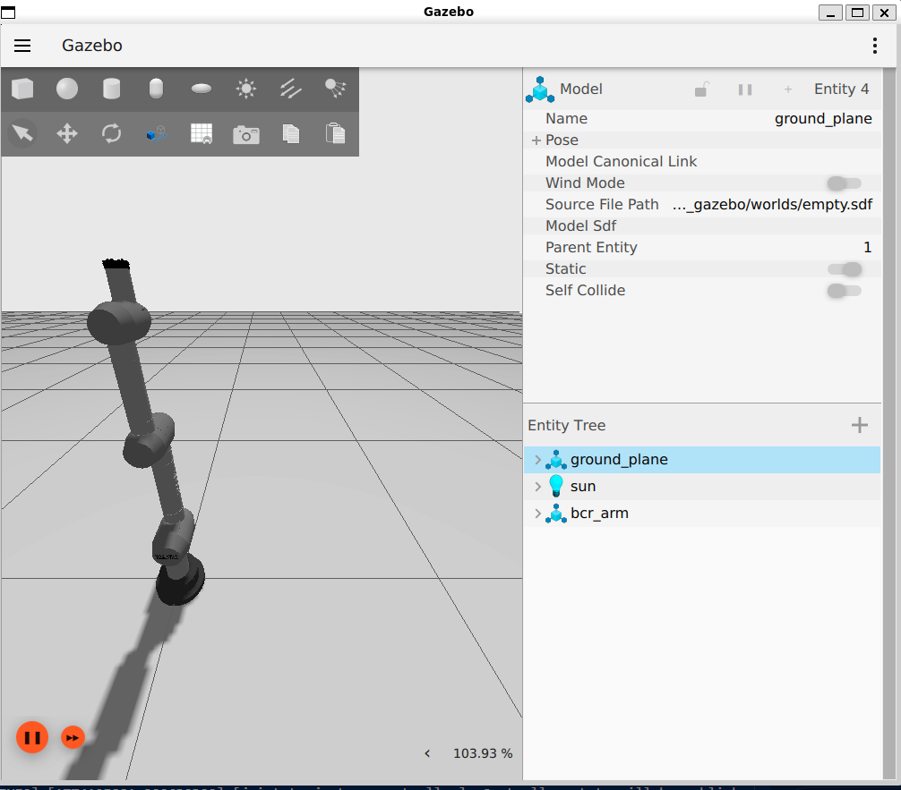
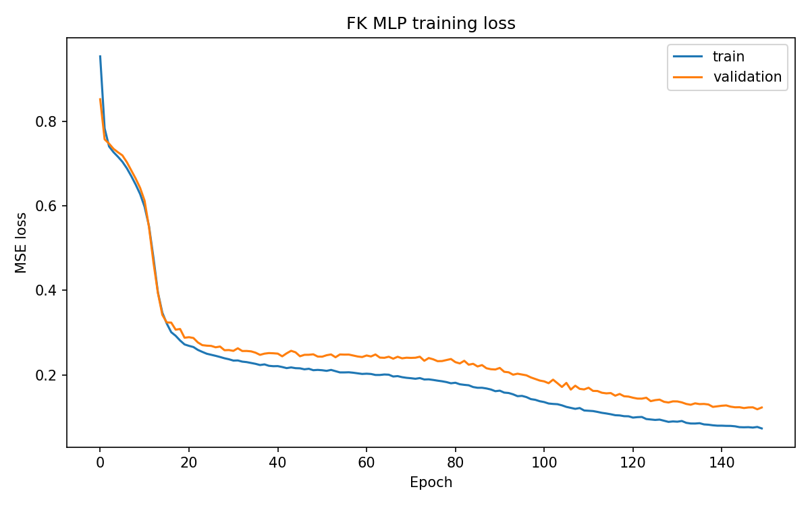

# TP3 Robotics: BCR Arm Simulation, Kinematics, and AI Approximation

This repository delivers a complete ROS 2 Humble workspace for the 7-DOF Black Coffee Robotics arm inside WSL2. It reuses the provided `bcr_arm_description` package, adds Gazebo Sim and `ros2_control` integration, validates joint-space motion, computes forward kinematics from `/joint_states`, and extends the project with a CPU-only PyTorch MLP that learns the analytical FK mapping.

> Verified on Ubuntu 22.04 Jammy in WSL2 with ROS 2 Humble, Gazebo Sim / `ros_gz_sim`, active controllers, successful motion playback, FK console output, and an end-to-end AI training run.

## Demo

[Watch the recorded arm motion demo](moving_arm.mp4)

[](moving_arm.mp4)



## What This Project Covers

- 7-DOF arm description reused from the supplied `bcr_arm_description` package
- Gazebo Sim launch pipeline with `ros_gz_sim`
- `gz_ros2_control` hardware interface and controller startup sequence
- `joint_state_broadcaster` and `joint_trajectory_controller`
- scripted motion test: home -> test pose -> home
- analytical forward kinematics using DH matrices
- live MLP inference from the ordered 7-joint state vector
- live analytical-vs-predicted FK comparison
- AI extension: dataset generation, MLP training, evaluation, saved model, and plots
- helper scripts, VS Code tasks, and report-oriented documentation

## Verified Results

### Runtime Validation

- Gazebo launches and renders the BCR arm correctly
- the robot is spawned from `robot_description`
- `joint_state_broadcaster` is active
- `joint_trajectory_controller` is active
- the motion script publishes and completes the three-step trajectory sequence
- FK node subscribes to `/joint_states` and reports end-effector position

### AI Validation

Dataset split:

- train: `7000`
- validation: `1500`
- test: `1500`

Metrics from [`fk_mlp_metrics.json`](bcr_ws/src/bcr_arm_gazebo/models/fk_mlp_metrics.json):

| Metric | X | Y | Z |
|---|---:|---:|---:|
| MAE | 0.106253 | 0.112794 | 0.072709 |
| RMSE | 0.134917 | 0.140585 | 0.093391 |

Live comparison example at the home pose:

- analytical FK: `(0.0600, 0.0000, 1.0250) m`
- predicted FK: `(-0.0539, 0.0484, 1.0386) m`
- Euclidean error: `0.1245 m`

Artifacts:

- trained model: [`fk_mlp.pt`](bcr_ws/src/bcr_arm_gazebo/models/fk_mlp.pt)
- training plot: [`fk_mlp_loss.png`](bcr_ws/src/bcr_arm_gazebo/plots/fk_mlp_loss.png)
- prediction examples: [`fk_prediction_examples.csv`](bcr_ws/src/bcr_arm_gazebo/plots/fk_prediction_examples.csv)
- generated dataset: [`fk_dataset.csv`](bcr_ws/src/bcr_arm_gazebo/data/fk_dataset.csv)

## Repository Structure

```text
.
├── README.md
├── INSTALL_WSL_UBUNTU.md
├── moving_arm.mp4
├── docs/
│   ├── media/
│   ├── dh_notes.md
│   ├── report_todo.md
│   ├── results_summary.md
│   ├── tp3_requirements_summary.md
│   ├── troubleshooting.md
│   └── validation_checklist.md
├── tools/
├── .vscode/
└── bcr_ws/
    └── src/
        ├── bcr_arm_description/
        └── bcr_arm_gazebo/
```

## Quick Start

### 1. Install WSL / ROS Dependencies

See [`INSTALL_WSL_UBUNTU.md`](INSTALL_WSL_UBUNTU.md).

### 2. Create the Project Virtual Environment

```bash
./tools/setup_venv.sh
```

### 3. Source ROS + Workspace + Venv

```bash
source tools/source_ros.sh
```

### 4. Build

```bash
./tools/build_ws.sh
```

### 5. Launch Simulation

Terminal 1:

```bash
source tools/source_ros.sh
./tools/run_gazebo.sh
```

If WSLg / Ogre is unstable:

```bash
BCR_HEADLESS=true ./tools/run_gazebo.sh
```

Terminal 2:

```bash
source tools/source_ros.sh
./tools/run_fk.sh
```

Terminal 3:

```bash
source tools/source_ros.sh
./tools/run_motion_test.sh
```

Terminal 4:

```bash
source tools/source_ros.sh
./tools/run_fk_predictor.sh
```

Terminal 5:

```bash
source tools/source_ros.sh
./tools/run_fk_comparison.sh
```

### 6. Run the AI Pipeline

```bash
source tools/source_ros.sh
./tools/run_ai_training.sh
```

## Main Files

### Core Packages

- [`bcr_ws/src/bcr_arm_description`](bcr_ws/src/bcr_arm_description)
- [`bcr_ws/src/bcr_arm_gazebo`](bcr_ws/src/bcr_arm_gazebo)

### Launch and Control

- [`bcr_arm.gazebo.launch.py`](bcr_ws/src/bcr_arm_gazebo/launch/bcr_arm.gazebo.launch.py)
- [`ros2_controllers.yaml`](bcr_ws/src/bcr_arm_gazebo/config/ros2_controllers.yaml)
- [`test_arm_movement.py`](bcr_ws/src/bcr_arm_gazebo/scripts/test_arm_movement.py)
- [`forward_kinematics.py`](bcr_ws/src/bcr_arm_gazebo/scripts/forward_kinematics.py)
- [`predict_fk_mlp.py`](bcr_ws/src/bcr_arm_gazebo/scripts/predict_fk_mlp.py)
- [`compare_fk_streams.py`](bcr_ws/src/bcr_arm_gazebo/scripts/compare_fk_streams.py)

### AI Scripts

- [`generate_fk_dataset.py`](bcr_ws/src/bcr_arm_gazebo/scripts/generate_fk_dataset.py)
- [`train_fk_mlp.py`](bcr_ws/src/bcr_arm_gazebo/scripts/train_fk_mlp.py)
- [`evaluate_fk_mlp.py`](bcr_ws/src/bcr_arm_gazebo/scripts/evaluate_fk_mlp.py)

### Documentation

- [`REPORT.md`](REPORT.md)
- [`docs/project_study_guide.md`](docs/project_study_guide.md)
- [`docs/results_summary.md`](docs/results_summary.md)
- [`docs/validation_checklist.md`](docs/validation_checklist.md)
- [`docs/dh_notes.md`](docs/dh_notes.md)
- [`docs/report_todo.md`](docs/report_todo.md)

## Known WSL Notes

- This project standardizes on a repo-local `.venv` built from Ubuntu Python `3.10` for ROS 2 Humble compatibility.
- The helper scripts automatically activate the venv and source ROS.
- Gazebo GUI rendering under WSLg can be flaky on some drivers; a headless fallback is provided.

## Submission Assets

- motion video: [`moving_arm.mp4`](moving_arm.mp4)
- Gazebo screenshot: [`docs/media/gazebo_arm_render.png`](docs/media/gazebo_arm_render.png)
- AI plot: [`bcr_ws/src/bcr_arm_gazebo/plots/fk_mlp_loss.png`](bcr_ws/src/bcr_arm_gazebo/plots/fk_mlp_loss.png)

## License Note

The provided robot description package already declares `Apache-2.0`. This repository preserves and builds on that supplied coursework material.
